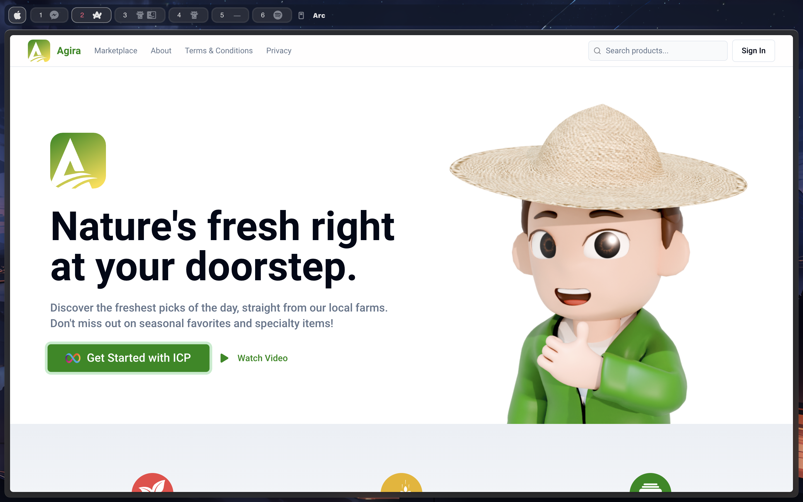

# Agira



**Agira** is a revolutionary application designed to directly connect farmers and consumers, aiming to transform the agriculture industry with a comprehensive farm listing system and blockchain incentives. The application leverages modern web technologies and blockchain services to provide a seamless and efficient experience for both farmers and consumers.

## Tech Stack

- **Frontend**: Next.js (TypeScript, React)
- **Styling**: TailwindCSS
- **Backend Services**: Juno (Blockchain-as-a-Service for ICP)
- **Authentication**: ICP Authentication (Passkey)

## Why Juno?

Juno stands out as a game-changer for decentralized application development by offering an accessible and efficient alternative to traditional ICP workflows. Unlike Azle, Juno simplifies the development and deployment of dApps on ICP by providing a suite of plug-and-play services, similar to Firebase but tailored for blockchain. This approach lowers the barrier to entry and accelerates development, making it an ideal choice for our project.

## Project Setup

To get started with Agira, follow these steps:

1. **Clone the Repository**

   ```bash
   git clone https://github.com/your-repo/agira-dapp.git
   cd agira-dapp
   ```

2. **Install Dependencies**

   ```bash
   npm install
   ```

3. **Build the Project**

   ```bash
   npm run build
   ```

4. **Login to Juno**

   ```bash
   juno login
   ```

5. **Deploy to Juno**

   ```bash
   juno deploy
   ```

6. **Update Canister ID**

   - Open the `juno.config.ts` file in your project.
   - Replace the placeholder canister ID with your own canister ID from Juno.
   - Save the file.

   **Example:**

   ```typescript
   import { defineConfig } from "juno";

   export default defineConfig({
     satellite: {
       id: "your-own-canister-id-here",
       source: "out",
     },
   });
   ```

7. **Create Collections in Juno**

   - Go to the [Juno website](https://juno.build).
   - Create a collection named `orders`.
   - Create a collection named `cart`.

8. **Read the Juno Documentation**

   For more information on how to use Juno, visit the [Juno Documentation](https://internetcomputer.org/docs/current/developer-docs/web-apps/frameworks/juno).

## Canister ID

- **Canister ID**: mdw7w-piaaa-aaaal-ajoma-cai from `juno.config.ts`.
- **Website**: [Agira on ICP](https://mdw7w-piaaa-aaaal-ajoma-cai.icp0.io/)

## Features

### Consumer Side

- **Complete CRUD Operations**: Allows consumers to create, read, update, and delete their orders and cart items.

### Farmer Side

- **Product Management**: Farmers can now add products to the marketplace. However, the dashboard and orders management features are still a work in progress (WIP).

## Known Issues

- **Deployment Requirement**: Every time a product is added, the dApp must be redeployed. This issue arises due to limitations with Next.js and the `@dfinity/agent` library.

## Project Description

**Agira** is dedicated to revolutionizing the agriculture industry by facilitating direct connections between farmers and consumers. With its farm listing system and blockchain-based incentives, Agira strives to provide mutual benefits for both farmers and consumers, fostering a more efficient and transparent agricultural marketplace.

## Hackathon Entry

This project is an entry for the [ISLACamp Hackathon](https://hackathon.islacamp.ph/).

## Contributing

If you would like to contribute to Agira, please follow the standard GitHub flow:

1. Fork the repository.
2. Create a new branch (`git checkout -b feature-branch`).
3. Commit your changes (`git commit -am 'Add new feature'`).
4. Push to the branch (`git push origin feature-branch`).
5. Open a pull request.

## Special Thanks

A special thanks to **peterpeterparker**, the creator of Juno, for providing insights and solutions to overcome some of the challenges faced with dynamic routing in Next.js and the `@dfinity/agent` library.

## License

This project is licensed under the GNU General Public License v3.0 - see the [LICENSE](LICENSE) file for details.

## Presentation

Watch the presentation of Agira on YouTube: [Watch Video](https://youtu.be/rGeZArwjVbU)
